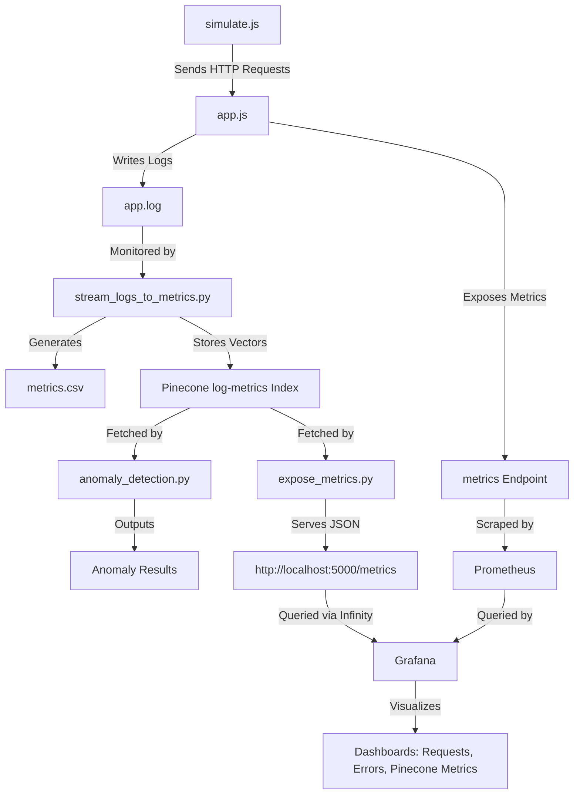

# Log-to-Metrics Observability Pipeline

This project demonstrates an observability pipeline that collects logs from a Node.js application, converts them to metrics, stores metrics in Pinecone for vector-based analysis, detects anomalies, and visualizes metrics using Prometheus and Grafana. It’s designed for monitoring a simple API with simulated traffic, suitable for learning observability and AI-driven anomaly detection.

## Table of Contents

- [Prerequisites](#prerequisites)
- [Project Structure](#project-structure)
- [Setup Instructions](#setup-instructions)
- [Running the Pipeline](#running-the-pipeline)
- [Troubleshooting](#troubleshooting)
- [License](#license)

## Prerequisites

- **MacOS** with VS Code installed.
- **Node.js** (v14 or later): Install via [Homebrew](https://brew.sh) with `brew install node`.
- **Python 3.13.3**: Install via Homebrew with `brew install python@3.13`.
- **Docker**: Install [Docker Desktop](https://www.docker.com/products/docker-desktop) for Prometheus and Grafana.
- **Pinecone Account**: Sign up at [Pinecone](https://app.pinecone.io) and get your API key and environment (found in **API Keys** or **Projects**).
- **GitHub Account**: For version control.

## Project Structure

```markdown
log-to-metrics/
├── app.js                # Node.js app with API and Prometheus metrics
├── simulate.js           # Simulates HTTP requests to generate logs
├── logs_to_metrics.py    # Converts app.log to metrics.csv
├── store_metrics.py      # Stores metrics in Pinecone
├── anomaly_detection.py  # Detects anomalies in Pinecone vectors
├── prometheus/
│   └── prometheus.yml    # Prometheus configuration
├── app.log               # Generated logs (gitignored)
├── metrics.csv           # Generated metrics (gitignored)
├── venv/                 # Python virtual environment (gitignored)
├── node_modules/         # Node.js dependencies (gitignored)
├── package.json          # Node.js dependencies
├── package-lock.json     # Node.js dependency lock
├── .gitignore            # Git ignore file
├── README.md             # This file
```

## Setup Instructions

Clone the repository and set up the environment.

### 1. Clone the Repository

```bash
git clone <your-repo-url>
cd log-to-metrics
```

### 2. Set Up Node.js Dependencies

Install Node.js dependencies for `app.js` and `simulate.js`.

```bash
npm install
```

Verify `express`, `winston`, and `prom-client` are in `package.json`.

### 3. Set Up Python Virtual Environment

Create and activate a virtual environment for Python scripts.

```bash
python3 -m venv venv
source venv/bin/activate
```

Install Python dependencies:

```bash
pip3 install pandas pinecone-client scipy numpy
```

### 4. Set Up Pinecone API Key

Set your Pinecone API key as an environment variable:

```bash
export PINECONE_API_KEY='your-pinecone-api-key'
```

Verify:

```bash
echo $PINECONE_API_KEY
```

To make persistent, add to `~/.zshrc`:

```bash
echo 'export PINECONE_API_KEY=your-pinecone-api-key' >> ~/.zshrc
source ~/.zshrc
```

Find your Pinecone environment (e.g., `us-east-1-aws`) in the Pinecone console under **API Keys** or **Projects**. Update `store_metrics.py` with your environment:

```python
spec=ServerlessSpec(cloud='aws', region='your-environment')
```

### 5. Verify Prometheus and Grafana

Ensure Docker Desktop is running. No additional setup is needed; containers will be started in the running instructions.

## Running the Pipeline

Follow these steps to run the full pipeline.

### 1. Start Prometheus

Run the Prometheus container to scrape metrics from `app.js`.

```bash
docker run -d --name prometheus -p 9090:9090 -v $(pwd)/prometheus/prometheus.yml:/etc/prometheus/prometheus.yml prom/prometheus
```

Verify at `http://localhost:9090/targets`. The `node_app` target (`host.docker.internal:3000`) should be “UP.”

### 2. Start Grafana

Run the Grafana container for visualization.

```bash
docker run -d --name grafana -p 3001:3000 grafana/grafana-oss
```

Log in at `http://localhost:3001` (default: admin/admin, change password if prompted).

Configure the Prometheus data source:

- Go to **Configuration** > **Data Sources** > **Add data source** > **Prometheus**.
- Set URL to `http://host.docker.internal:9090`.
- Click **Save & Test** (should say “Data source is working”).

Create a dashboard:

- Go to **Create** > **Dashboard** > **Add new panel**.
- Add panels:
  - **Requests per Second**: Query `rate(http_requests_total[5m])`, Title “Requests per Second”, Visualization: Time Series.
  - **Error Rate**: Query `rate(http_requests_total{status="500"}[5m]) / rate(http_requests_total[5m])`, Title “Error Rate”, Visualization: Time Series.
- Save the dashboard.

### 3. Start the Node.js App

Run the Node.js app to serve API endpoints and expose metrics.

```bash
deactivate  # Exit virtual environment if active
node app.js
```

Verify at `http://localhost:3000/api/user` (should return “User data retrieved”).

### 4. Simulate Traffic

Generate logs by simulating HTTP requests.

```bash
node simulate.js
```

Expect ~200 requests (100 GET, 100 POST, ~20% POST failures). Check `app.log` for JSON logs.

### 5. Convert Logs to Metrics

Convert `app.log` to `metrics.csv`.

```bash
source venv/bin/activate
python3 logs_to_metrics.py
```

Check `metrics.csv` for metrics (e.g., `timestamp,request_count,error_count,avg_latency`).

### 6. Store Metrics in Pinecone

Store metrics as vectors in Pinecone.

```bash
python3 store_metrics.py
```

Expect output like “Stored 6 vectors in Pinecone.”

### 7. Detect Anomalies

Run anomaly detection on Pinecone vectors.

```bash
python3 anomaly_detection.py
```

Expect output like “No anomaly at [timestamp]: [vector]” or “Anomaly detected at [timestamp]: [vector].”

### 8. View Metrics

- **Prometheus**: Query `http_requests_total` at `http://localhost:9090/graph`.
- **Grafana**: View dashboards at `http://localhost:3001`.

## Troubleshooting

- **Prometheus Target Down**:
  - Verify `app.js` is running:

    ```bash
    curl http://localhost:3000/metrics
    ```

    Expect Prometheus metrics (e.g., `http_requests_total...`).
  - Check Prometheus logs:

    ```bash
    docker logs prometheus
    ```

  - Ensure `prometheus.yml` targets `host.docker.internal:3000`.
- **Grafana Connection Refused**:
  - Verify Prometheus is running:

    ```bash
    curl http://localhost:9090
    ```

  - Use `http://host.docker.internal:9090` in Grafana’s data source.
  - Check for port conflicts:

    ```bash
    netstat -an | grep 9090
    ```

- **Pinecone Errors**:
  - Test connectivity:

    ```bash
    python3 -c "from pinecone import Pinecone; pc = Pinecone(api_key='$PINECONE_API_KEY'); print(pc.list_indexes().names())"
    ```

  - Verify `PINECONE_API_KEY` and environment in `store_metrics.py`.
- **Empty `metrics.csv`**:
  - Check `app.log` has ~200 entries:

    ```bash
    wc -l app.log
    ```

  - Rerun `simulate.js`.

## Diagram



## License

MIT License. See [LICENSE](LICENSE) for details.
